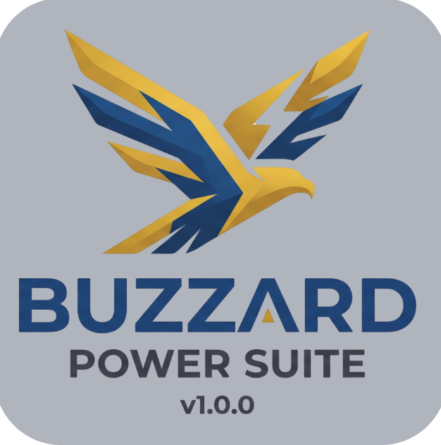
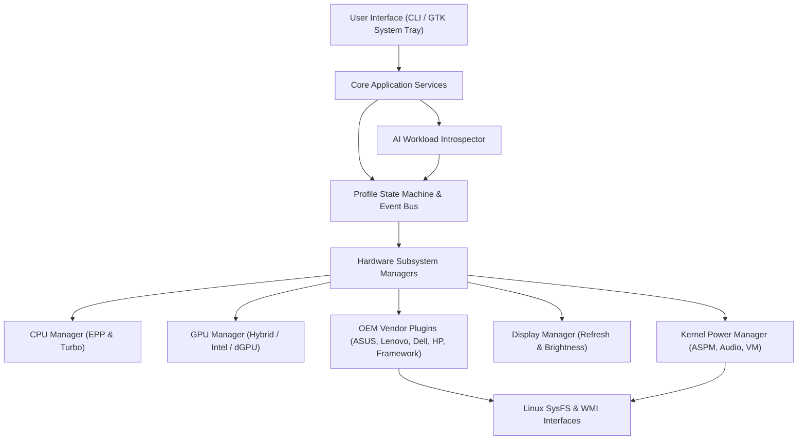

<p align="center">
  
</p>

# 🦅 Buzzard Power Suite v1.0.0

[](https://github.com/buzzard/buzzard-power-suite)
[](https://opensource.org/licenses/MIT)
[](https://www.python.org/)
[](https://kernel.org)

> **Universal Linux Power Management & AI Adaptive Workload Suite**  
> *MacBook-Level Battery Optimization (~3.5W–5.0W Discharge Rates), Dynamic Desktop System Tray GUI, OEM Multi-Vendor Support, and Workload Auto-Switching.*

---

## 🌟 Key Highlights

- **🍏 `MacMode` / `Ultra` Power Engine:** Deep kernel power optimization enforcing PCIe ASPM `powersave`, NMI watchdog disable, VM dirty writeback tuning, audio DAC auto-suspend (1s), and CPU EPP gating—yielding battery discharge rates as low as **3.5W–5.0W** (MacBook-level efficiency).
- **📶 Enforced High-Performance Wi-Fi:** Wi-Fi power save features (`power_save off`) are explicitly **disabled** across all profiles (`macmode`, `low`, `travel`, `hybrid`, `full`), guaranteeing maximum network speed and zero latency throttling.
- **🖥️ Desktop System Tray GUI (`buzzard-gui`):** Dynamic GTK3/AppIndicator system tray application using the official Buzzard logo, showing live battery wattage draw (W), estimated runtime remaining, one-click profile switching, and quick hardware controls (80% charge conservation limit, refresh rate switching).
- **💻 Multi-Vendor OEM Plugin Engine:** Out-of-the-box hardware integration for **ASUS** (Vivobook, ROG, TUF), **Lenovo** (IdeaPad, ThinkPad, Legion), **Dell** (XPS, Latitude), **HP** (Spectre, OMEN, Pavilion, EliteBook), and **Framework** (13 / 16) laptops.
- **🤖 AI & Workload Adaptive Engine (`buzzard auto`):** Introspects process tables and dynamically shifts profiles based on active applications (**Gaming**, **LLM/AI**, **Creator**, **Security/Pentest**, **Meetings**).
- **🐧 Universal Cross-Distro Portability:** Native package manager introspection (`apt`, `pacman`, `dnf`, `zypper`) with automated passwordless sysfs permission configuration (`/etc/sudoers.d/buzzard`).

---

## 🏗️ System Architecture



---

## 📦 Installation & Setup

### ⚡ One-Line Automatic Setup (All Distros)
To install Buzzard Power Suite, configure native dependencies (`tlp`, `powertop`, `power-profiles-daemon`), and set up passwordless sysfs hardware privileges:

```bash
git clone https://github.com/buzzard/buzzard-power-suite.git
cd Buzzard-Power-Suite
sudo ./install.sh
```

### 🐍 Manual Installation via PyPI / Pip
```bash
pip install -e .
buzzard setup
```

---

## 💻 Usage & Command Reference

### CLI Commands (`buzzard <command>`)

| Command | Description |
| :--- | :--- |
| `buzzard macmode` (or `ultra`) | **Apply MacBook-Level Ultra Power Saver profile** (~3.5W–5.0W draw) |
| `buzzard auto` | **Run AI & Workload Adaptive engine** to auto-select optimal profile |
| `buzzard status` | Display active profile, battery telemetry, GPU state, and wattage draw |
| `buzzard gui` | Launch the Desktop System Tray GTK telemetry application |
| `buzzard low` | Apply Low Power Saver profile |
| `buzzard hybrid` | Apply Hybrid Balanced profile |
| `buzzard full` | Apply Full Performance profile |
| `buzzard gaming` | Apply Gaming profile (GPU Boost + 120Hz/144Hz + Turbo) |
| `buzzard creator` | Apply Creator profile (Balanced CPU/GPU + High Refresh) |
| `buzzard travel` | Apply Travel Saver profile |
| `buzzard meeting` | Apply Quiet Meeting profile (Silent Fans + Turbo Off) |
| `buzzard doctor` | Run diagnostic health checks on hardware power subsystems |
| `buzzard package <type>` | Build distribution packages (`deb`, `arch`, `rpm`, `all`) |

---

## 🖥️ Desktop System Tray GUI (`buzzard-gui`)

Launch the background system tray application:

```bash
buzzard-gui
```

### Features:
- **Official Branding:** Uses the official Buzzard logo in the system tray & notification center.
- **Live Battery Telemetry:** Real-time wattage draw (e.g. `⚡ Draw: 4.12 W | Runtime: 16.5h`) refreshed every 3 seconds.
- **One-Click Profile Switcher:** Instantly switch between `MacMode`, `Low`, `Hybrid`, `Full`, `Gaming`, `Creator`, `Travel`, `Meeting`, and `Auto`.
- **Quick Hardware Controls:**
  - Toggle 80% Battery Conservation Charge Limit vs 100% Full Charge.
  - Switch Display Refresh Rate (60Hz / 120Hz / 144Hz).
- **System Doctor Diagnostics:** One-click launch of hardware diagnostics.

---

## 🤖 AI & Workload Adaptive Engine

Run `buzzard auto` to enable real-time process introspection. The engine auto-shifts profiles based on active applications:

| Workload Category | Detected Process Signatures | Active Target Profile |
| :--- | :--- | :--- |
| **Gaming** | `steam`, `lutris`, `heroic`, `cs2`, `dota2`, `proton` | `gaming` |
| **AI / LLM** | `ollama`, `vllm`, `llama.cpp`, `comfyui`, `torch` | `llm` |
| **Creator Workstation** | `blender`, `resolve`, `gimp`, `inkscape`, `obs` | `creator` |
| **Security / Pentest** | `wireshark`, `burpsuite`, `nmap`, `msfconsole`, `ghidra` | `pentest` |
| **Meetings & Calls** | `zoom`, `teams`, `slack`, `discord`, `webex` | `meeting` |
| **Idle / Light Work (Battery)** | Browsers, text editors, terminal | `macmode` |

---

## 📦 Linux Package Distribution

Build native distribution packages for Linux package managers:

```bash
# Build all package formats
buzzard package all

# Or build individual package manifests:
buzzard package deb   # Generates Debian / Ubuntu .deb control files
buzzard package arch  # Generates Arch Linux PKGBUILD for AUR
buzzard package rpm   # Generates Fedora / RHEL RPM spec files
```

Generated packages will be stored in `build/dist_packages/`.

---

## 🧪 Testing & Verification

Run the comprehensive unit & integration test suite:

```bash
pytest -v
```

All 53 unit and integration test cases verify profile state transitions, hardware sysfs access, vendor plugins, packaging generators, and adaptive introspection.

---

## 📄 License

This project is licensed under the **MIT License** - see the [LICENSE](LICENSE) file for details.
